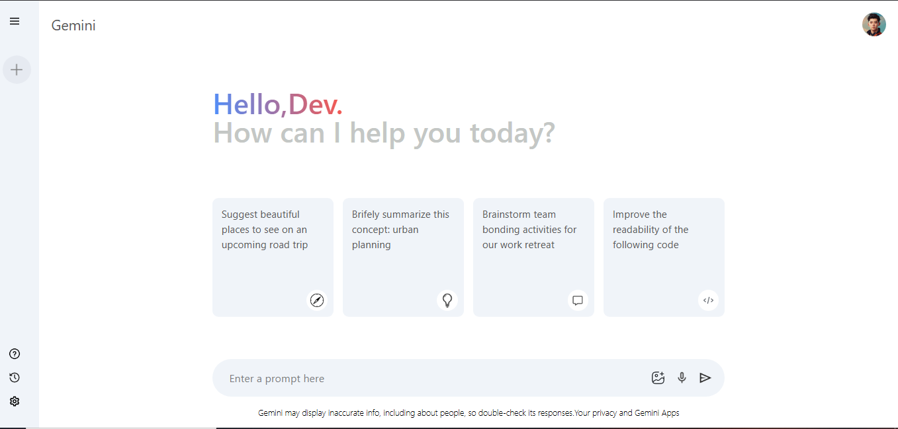
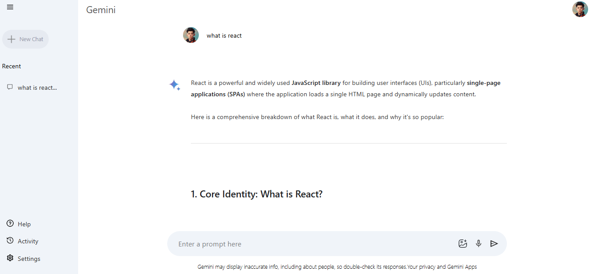

# 🚀 Gemini AI Clone

A **Gemini AI Clone** built using **React.js** and **Tailwind CSS**.  
This project replicates the modern UI and smooth user experience of Gemini AI with a clean, responsive design.

---

## 🔗 Live Demo

👉 [Click Here to Try Gemini AI Clone](https://gemini-clone-alpha-pearl.vercel.app/)

# 🚀 Gemini AI Clone

[](https://reactjs.org/)  
[](https://tailwindcss.com/)  
[](https://aistudio.google.com/)

## 📸 Preview




## 📌 Features

- ⚡ Fast and responsive UI
- 🎨 Built with Tailwind CSS for modern styling
- 🖼️ Gemini-inspired chat interface
- 💬 Smooth typing & message bubbles
- 🌙 Dark & Light mode support (optional if added)
- 📱 Fully responsive (mobile, tablet, desktop)

---

## 🛠️ Tech Stack

- **React.js** – Frontend framework
- **Tailwind CSS** – Styling
- **Vite / CRA** – Build tool (mention whichever you used)

---

---

## ⚙️ Installation & Setup

Clone the repository:

```bash
git clone https://github.com/your-username/gemini-ai-clone.git
cd gemini-ai-clone
```

```bash
npm install
```

Start the development server:

```bash
npm start
```

Open [http://localhost:3000](http://localhost:3000) to view it in the browser.
